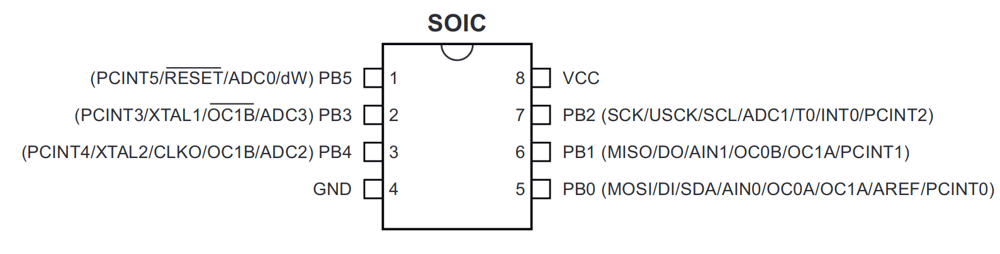
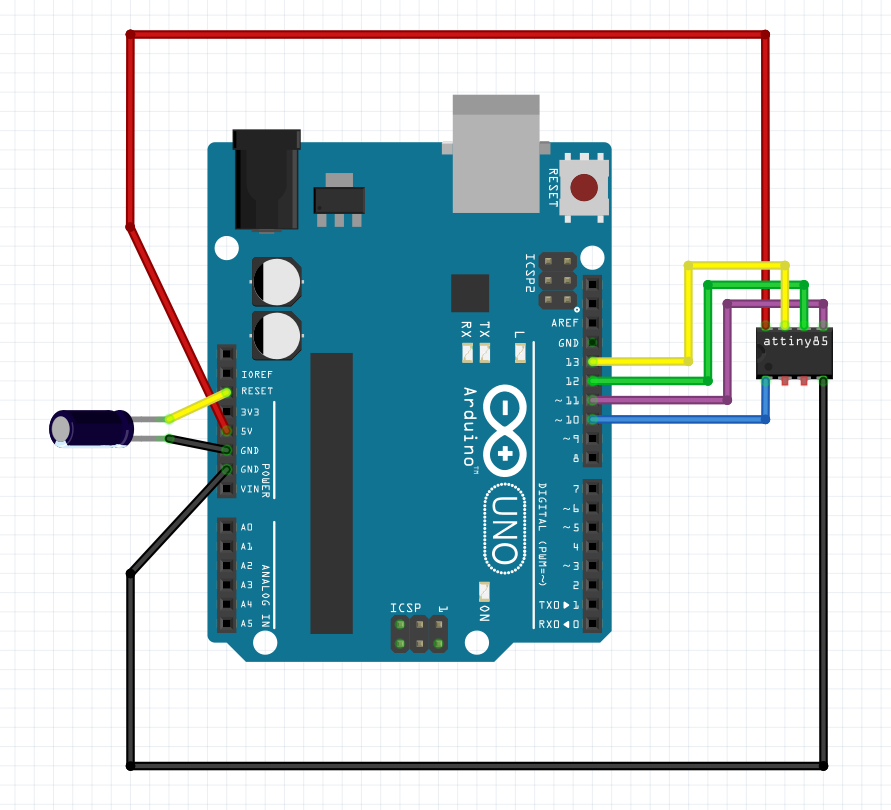

# Programming the ATtiny85 — C Implementation

This project uses a **Makefile** for all build and flash operations. Manual
`avr-gcc` invocations are shown for reference only; always use `make` for
a correct, reproducible build.

## Prerequisites

Install the AVR toolchain:

```bash
# Debian / Ubuntu / Raspberry Pi OS
sudo apt-get install make gcc-avr binutils-avr avr-libc avrdude

# macOS (Homebrew)
brew tap osx-cross/avr
brew install avr-gcc avrdude
```

## Firmware variants

| Folder | Trigger | Notes |
|---|---|---|
| `C_implementation/tactile_switch/` | Tactile push button on PB1 | Active-low, internal pull-up enabled |
| `C_implementation/touch_pad/` | TTP223 capacitive sensor on PB1 | Active-high, no pull-up |

Navigate to whichever variant you are building before running any `make` command.

## Build with Make (recommended)

```bash
cd C_implementation/tactile_switch   # or touch_pad
make          # compiles main.elf and main.hex
make upload   # flashes to chip via Arduino-as-ISP
make clean    # removes build artefacts
```

To set fuses on a fresh chip (one-time operation per chip):

```bash
make set-fuses
```

## Manual build (for reference only)

A V-USB project requires the V-USB sources and the correct `F_CPU` define.
The bare minimum correct invocation is:

```bash
# From inside C_implementation/tactile_switch (or touch_pad):
avr-gcc -mmcu=attiny85 -DF_CPU=16000000UL -Wall -Os \
  -I./usbdrv \
  -o main.elf \
  main.c \
  usbdrv/usbdrv.c \
  usbdrv/usbdrvasm.S

avr-objcopy -O ihex -R .eeprom main.elf main.hex
```

> [!WARNING]
> A bare `avr-gcc -mmcu=attiny85 -Os -o main.elf main.c` will fail — it is
> missing the V-USB sources, the include path, and the mandatory `-DF_CPU`
> define. Use `make` instead.

## Programmer options

### Option A — Arduino as ISP (used by default in Makefile)

1. **Prepare Arduino Uno**: Upload the ArduinoISP sketch to your Arduino Uno board using the Arduino IDE. This sketch turns the Arduino Uno into an ISP programmer.

2. **Connect Arduino Uno as ISP**: Connect your Arduino Uno to your computer via USB. Then, connect the following pins from the Arduino Uno to the ATtiny85:
    - Arduino Uno **5V** pin to ATtiny85 **VCC** pin
    - Arduino Uno **GND** pin to ATtiny85 **GND** pin
    - Arduino Uno **Pin 10** (SS) to ATtiny85 **RESET** pin
    - Arduino Uno **Pin 11** (MOSI) to ATtiny85 **MOSI** pin
    - Arduino Uno **Pin 12** (MISO) to ATtiny85 **MISO** pin
    - Arduino Uno **Pin 13** (SCK) to ATtiny85 **SCK** pin
      
      

3. **Compile Your Code**: Compile your code into a `.hex` file using `avr-gcc` and `avr-objcopy`. For example:

    ```bash
    avr-gcc -mmcu=attiny85 -DF_CPU=16000000UL -Os -I./usbdrv -o main.elf main.c usbdrv/usbdrv.c usbdrv/usbdrvasm.S
    avr-objcopy -O ihex -R .eeprom main.elf main.hex
    ```

4. **Upload `.hex` File**: Use AVRDUDE or a similar programming tool to upload the `.hex` file to the ATtiny85. For example:

    ```bash
    avrdude -c avrisp -p attiny85 -P <port> -b 19200 -U flash:w:main.hex
    ```    
    Replace `<port>` with the serial port connected to your Arduino Uno.

    for example my port was /dev/ttyACM0
    
    ```bash

    avrdude -c avrisp -p attiny85 -P /dev/ttyACM0 -b 19200 -U flash:w:main.hex
    ```
    Replace `/dev/ttyACM0` with the correct port for your system (`/dev/cu.usbmodem*` on macOS, `COMx` on Windows).

5. **Verify Upload**: After uploading the `.hex` file, verify that the programming was successful. AVRDUDE may provide feedback or confirmation messages.

6. **Reset ATtiny85**: Once the upload is complete, reset the ATtiny85 by power-cycling it or using the RESET pin.

7. **Run Program**: After resetting the ATtiny85, it should execute your program.

### Option B — AVRISP mkII

```bash
avrdude -c avrisp2 -p attiny85 -U flash:w:main.hex
```

### Option C — Micronucleus bootloader

If the chip already has a Micronucleus bootloader flashed:

```bash
micronucleus --run main.hex
```

## Serial port permissions (Linux only)

```bash
sudo chmod a+rw /dev/ttyACM0
# Or add your user to the dialout group permanently:
sudo usermod -aG dialout $USER   # then log out and back in
```

[⬅ Back to README](README.md)
