# 🔐 Hardware Login Key

<p align="center">
  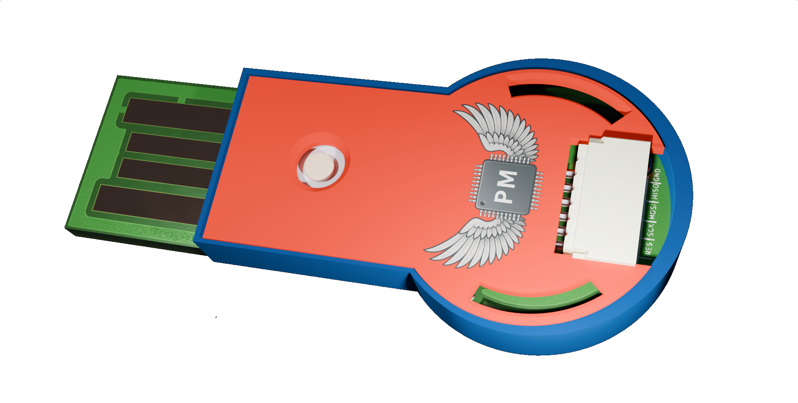<br/>

  
  
  
  
  
  
</p>

<p align="center">
  <b>Press or tap to auto-type your password suffix — the full password never exists in one place.</b><br/>
  <sub><i>The prefix stays in your mind, the suffix lives in your hand.</i></sub>
</p>


## Introduction

This project offers a straightforward solution for reducing password exposure when logging into a system or website. By pressing a physical button (or touching a capacitive pad) connected to an ATtiny85 microcontroller, the device automatically types a pre-stored password suffix, completing the login without exposing the full credential to observers.


<p align="center">
Pressing the tactile switch on the breadboard prototype sends a keystroke that appears in the terminal.
</p>

## 🎯 Purpose

The aim is to provide a practical alternative to manually typing long or complex passwords in environments where shoulder surfing or observation is a risk. The key injects only a suffix. The prefix stays in the user's memory, so physical possession of the device alone is not enough to authenticate.

## Benefits

- **Reduced exposure** — the full password is never typed in one place or stored in one location
- **Convenience** — complex suffixes are entered automatically with a button press
- **Privacy** — reduces shoulder surfing risk in public or shared environments
- **Portability** — a USB key fits on a keyring and works on any host

## ⚠️ Security Model & Limitations

This device is a **convenience tool**, not a cryptographic security device.

**What it protects against:** shoulder surfing and partial credential capture.

**What it does NOT protect against:**
- **Flash extraction** — the suffix is stored as **plaintext** in ATtiny85 flash
  memory. An attacker with physical access and a standard programmer can dump it
  in under a minute with AVRDUDE. There is no encryption, no secure boot, and no
  hardware protection on the ATtiny85.
- **Compromised host** — keystroke injection via USB HID is visible to any
  software-level keylogger running on the host.

> [!WARNING]
> The ATtiny85 has no hardware security primitives. This device is appropriate for personal, low-threat scenarios. For threat models involving physical access by a motivated attacker, a device with secure boot and encrypted storage is required.
>
>See [SECURITY.md](SECURITY.md) for the full threat model.

## How it Works
The hardware key utilizes an ATtiny85 microcontroller with the V-USB library to implement USB Human Interface Device (HID) keyboard functionality. This allows the ATtiny85 to act as a keyboard when connected to a computer via USB. When the button connected to the ATtiny85 is triggered, it injects a pre-stored password suffix followed by Enter.

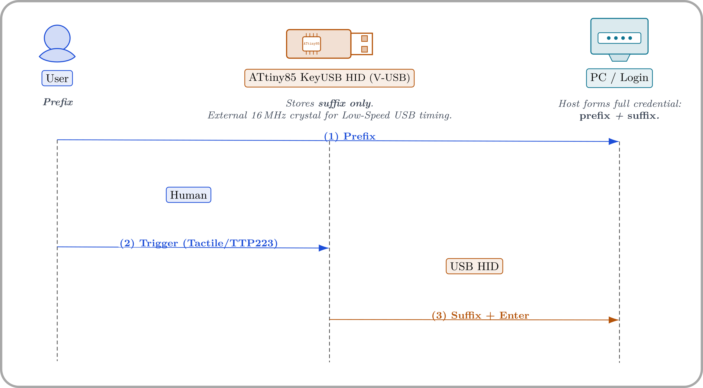
<p align="center">
Sequence: (1) user types the prefix, (2) user triggers the device (tactile button or
TTP223), and (3) the ATtiny85 injects suffix + Enter via USB HID. The host concatenates the
parts to form the full credential.
</p>


<p align="center">
From code to reality! The ATtiny85 Hardware Login Key project and its various prototypes. What started as a simple idea is now a fully functional set of secure login devices.
</p>

## Firmware Variants

| Variant | Trigger | Folder |
|---|---|---|
| Tactile switch | Push button on PB1 (active-low, internal pull-up) | `C_implementation/tactile_switch/` |
| Touch pad | TTP223 capacitive sensor on PB1 (active-high) | `C_implementation/touch_pad/` |

Both variants share the same V-USB HID keyboard implementation and the same two-piece password concept.

## Compilation Instructions

> [!TIP]
> **First time working with the ATtiny85?**
> 
> Before diving into this project, it's highly recommended to test your hardware setup and compilation process with a simpler program. The **[ATtiny85_Simple_Code_Test](ATtiny85_Simple_Code_Test/README.md)** project is a perfect "Hello, World!" for your hardware. It plays music through a speaker and confirms that your ATtiny85, programmer, and toolchain are all working correctly before you tackle the more complex V-USB library.

You can modify the permissions of `/dev/ttyACM0` to facilitate communication with your serial device. For detailed instructions, [click here](modify_permissions.md).

> [!IMPORTANT]
> **One-Time Fuse Setup for External Crystal**
> 
> The ATtiny85 must be configured to use the external 16MHz crystal. This is done by setting its "fuse bits." This is a **one-time operation** for each chip. Run this once on each fresh chip.
> 
> 1.  Connect your programmer to the ATtiny85.
> 2.  Run the following command to set the fuses for a 16MHz external crystal:
>     ```bash
>     avrdude -c avrisp -p attiny85 -P /dev/ttyACM0 -b 19200 -U lfuse:w:0xFF:m -U hfuse:w:0xDD:m
>     ```
>
> `lfuse 0xFF` selects the external crystal (8–16 MHz, full swing, maximum startup delay). `hfuse 0xDD` enables SPI programming, keeps the RESET pin active, and enables the Brown-Out Detector at 2.7 V — which prevents the chip from executing with an unstable supply during USB plug/unplug events.
>
> ### How to Revert to the Internal Oscillator
> If you later wish to use this ATtiny85 for a different project that does not require an external crystal, you can revert it to use its internal 8MHz oscillator.
> 
> To revert to the internal 8 MHz oscillator (no crystal needed), run the following command:
> ```bash
> avrdude -c avrisp -p attiny85 -P /dev/ttyACM0 -b 19200 -U lfuse:w:0xE2:m -U hfuse:w:0xDF:m
> ```
> This restores the chip to use its internal 8MHz clock source, which is a common setting for many projects (like the `ATtiny85_Simple_Code_Test`).
>
 
> [!WARNING]
> Be extremely careful when setting fuses. Incorrect fuse values can prevent the chip from being reprogrammed via ISP. Always verify values before running the command. Use https://www.engbedded.com/fusecalc/ to double-check.

Install the toolchain:

```bash
# Linux
sudo apt-get install make gcc-avr binutils-avr avr-libc avrdude

# macOS
brew tap osx-cross/avr && brew install avr-gcc avrdude
```

Build and flash (from inside a variant folder):

```bash
cd C_implementation/tactile_switch    # or touch_pad
make          # compile
make upload   # flash via Arduino-as-ISP
```

For detailed programmer wiring, port configuration, and manual build reference, see [INSTRUCTIONS_C.md](INSTRUCTIONS_C.md) and [C_Makefile_Instructions.md](C_Makefile_Instructions.md).

## 📋 Usage — Two-Piece Password

This hardware key uses a **"Two-Piece Password"** approach for enhanced security. The device does not store your full password. Instead, it stores only the complex second half, while you remember and type the simpler first half. This makes the physical key useless if it is ever lost or stolen.

> [!IMPORTANT]
> The device stores only the complex **suffix** of a password. The simpler **prefix** lives in the user's memory. The full credential never exists in a single place.

### The Concept in Action

Let's imagine your full, desired password is: `Key_!#2025_complex`

*   **The part you remember and type first (The Prefix):** `Key_`
*   **The part stored on your hardware key (The Suffix):** `!#2025_complex`

### Login Steps

1.  Navigate to the password field of the login form.
2.  Manually type the first part of your password (e.g., `Key_`).
3.  Plug in your hardware key.
4.  Press the button on the key.
5.  The key will automatically type the complex second half of the password (`!#2025_complex`) and press Enter, logging you in securely.

---

## PCB Designs

### In KiCad
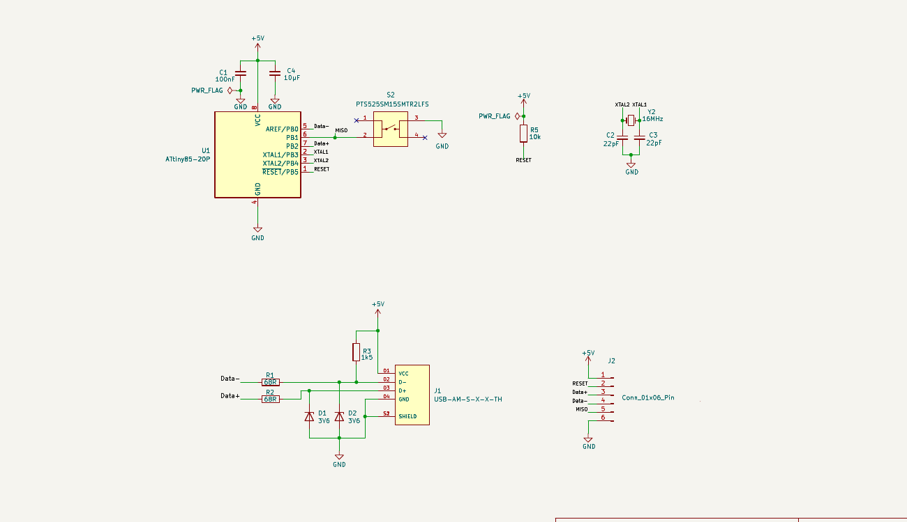

The hardware key is available in multiple PCB package versions to accommodate different assembly preferences:
- **Through-Hole (DIP)**: Easy to hand-solder, ideal for prototyping.
  - 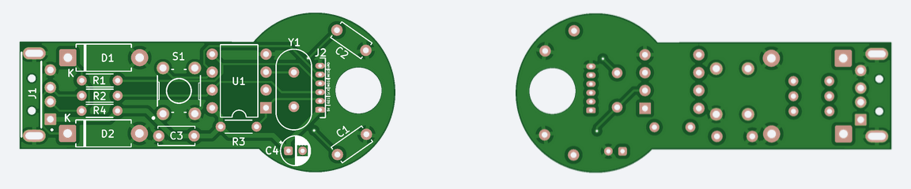
  *With tactile switch.*
- **SMD (SOIC)**: Compact and solderable by hand with a fine-tip iron.
  - 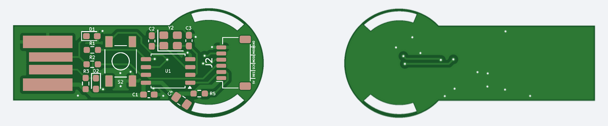
  *With tactile switch.*
- **SMD (QFN)**: Smallest footprint with push button.
  - 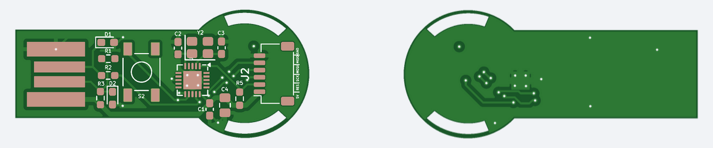
    *With tactile switch.*
 

  - 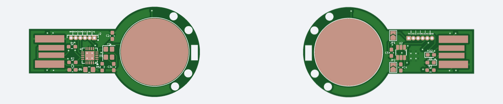
    **QFN PCB designed for a touch pad using the TTP223 IC for enhanced reliability.**  
    - Uses a simple high/low output for touch detection, similar to a tactile switch, providing a straightforward 0 or 1 output.  
    - The PCB is designed with **4 layers** to optimize signal integrity and reliability.


## 🛒 Requirements

### Through-Hole (DIP)

| Reference | Value | Footprint | Qty |
|---|---|---|---|
| C1, C2 | 22 pF | C_Disc_D5.0mm_W2.5mm_P5.00mm | 2 |
| C3 | 100 nF | C_Disc_D5.0mm_W2.5mm_P5.00mm | 1 |
| C4 | 10 µF | CP_Radial_D4.0mm_P2.00mm | 1 |
| D1, D2 | 3V6 Zener | D_DO-15_P10.16mm_Horizontal | 2 |
| J1 | USB-AM-S-X-X-TH | SAMTEC_USB-AM-S-X-X-TH | 1 |
| J2 | Conn 1×06 | Molex_PicoBlade_53047-0610 | 1 |
| R1, R2 | 68 Ω | R_Axial_DIN0204_P5.08mm | 2 |
| R3 | 10 kΩ | R_Axial_DIN0204_P5.08mm | 1 |
| R4 | 1.5 kΩ | R_Axial_DIN0204_P5.08mm | 1 |
| S1 | B3F-1000 | SW_B3F-1000 | 1 |
| U1 | ATtiny85-20P | DIP-8_W7.62mm | 1 |
| Y1 | 16 MHz | Crystal_HC49-4H_Vertical | 1 |

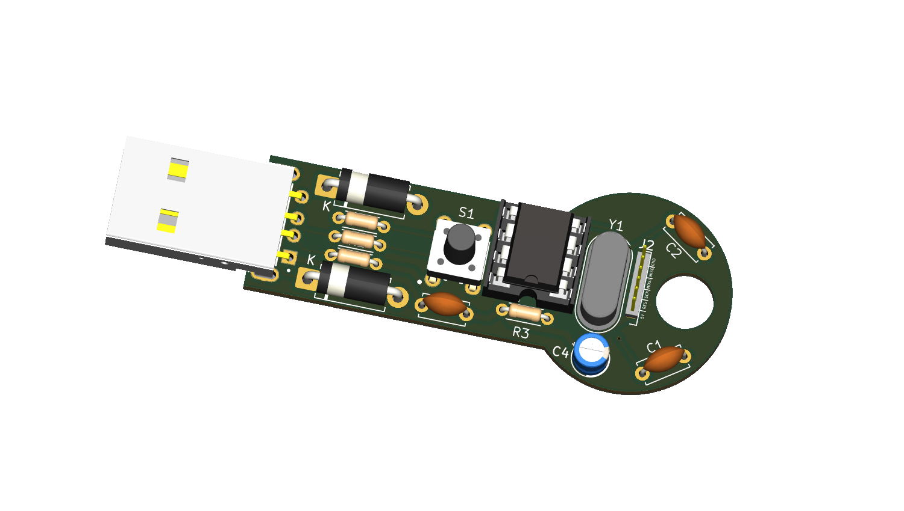
<p align="center">
  <b>DIP 3D render of the hardware login key’s PCB using the Through-Hole (DIP) package in KiCad</b>
</p>

### SMD — SOIC-8

| Reference | Value | Footprint | Qty |
|---|---|---|---|
| C1 | 100 nF | C_0603_HandSolder | 1 |
| C2, C3 | 22 pF | C_0603_HandSolder | 2 |
| C4 | 10 µF | C_0805_HandSolder | 1 |
| D1, D2 | 3V6 Zener | D_0603_HandSolder | 2 |
| J1 | USB-AM-S-X-X-TH | USB_PCB | 1 |
| J2 | Conn 1×06 | JST_SH_SM06B-SRSS-TB | 1 |
| R1, R2 | 68 Ω | R_0603_HandSolder | 2 |
| R3 | 1.5 kΩ | R_0603_HandSolder | 1 |
| R5 | 10 kΩ | R_0603_HandSolder | 1 |
| S2 | PTS525SM15SMTR2LFS | SW_PTS525SM15SMTR2LFS | 1 |
| U1 | ATtiny85-20P | SOIC-8_5.3x5.3mm | 1 |
| Y2 | 16 MHz | Crystal_SMD_3225-4Pin | 1 |

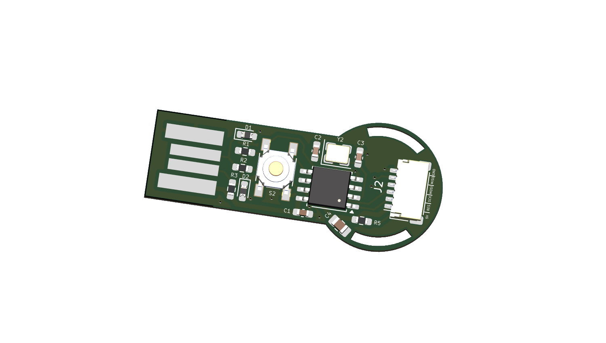
<p align="center">
  <b>3D model of the hardware login key’s PCB using the SMD (SOIC) package in KiCad.</b>
</p>

### SMD — QFN-20 with tactile switch

| Reference | Value | Footprint | Qty |
|---|---|---|---|
| C1 | 100 nF | C_0603_HandSolder | 1 |
| C2, C3 | 22 pF | C_0603_HandSolder | 2 |
| C4 | 10 µF | C_0805_HandSolder | 1 |
| D1, D2 | 3V6 Zener | D_0603_HandSolder | 2 |
| J1 | USB-AM-S-X-X-TH | USB_PCB | 1 |
| J2 | Conn 1×06 | JST_SH_SM06B-SRSS-TB | 1 |
| R1, R2 | 68 Ω | R_0603_HandSolder | 2 |
| R3 | 1.5 kΩ | R_0603_HandSolder | 1 |
| R5 | 10 kΩ | R_0603_HandSolder | 1 |
| S2 | PTS525SM15SMTR2LFS | SW_PTS525SM15SMTR2LFS | 1 |
| U1 | ATtiny85-20M | QFN-20-1EP_4x4mm | 1 |
| Y2 | 16 MHz | Crystal_SMD_3225-4Pin | 1 |

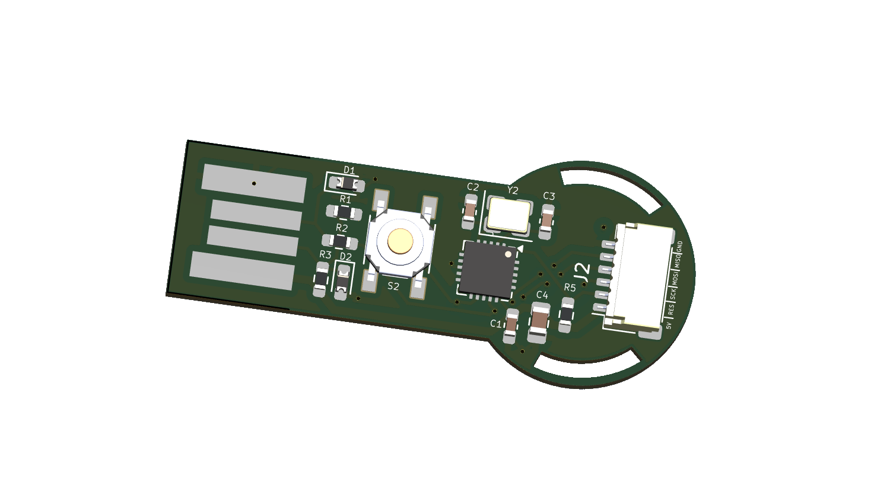
<p align="center">
  <b>3D model of the hardware login key’s PCB using the QFN package in KiCad.</b>
</p>

### SMD — QFN-20 with TTP223 capacitive touch (4-layer PCB) and Reversible USB Functionality

| Reference | Value | Footprint | Qty |
|---|---|---|---|
| C1 | 100 nF | C_0603_HandSolder | 1 |
| C2, C3 | 22 pF | C_0603_HandSolder | 2 |
| C4 | 1 µF | C_0603_HandSolder | 1 |
| C5 | 30 pF | C_0603_HandSolder | 1 |
| C6 | 10 µF | C_0805_HandSolder | 1 |
| D1, D2 | 3V6 Zener | D_0603_HandSolder | 2 |
| J1 | USB-AM-S-X-X-TH | USB_PCB | 1 |
| J2 | M50-3930642 | HARWIN_M50-3930642 | 1 |
| R1, R2 | 68 Ω | R_0603_HandSolder | 2 |
| R3 | 1.5 kΩ | R_0603_HandSolder | 1 |
| R5 | 10 kΩ | R_0603_HandSolder | 1 |
| TP1, TP2 | Test point | TestPoint_Pad_D3.0mm | 2 |
| U1 | ATtiny85-20M | QFN-20-1EP_4x4mm | 1 |
| U2 | TTP223-BA6 | SOT23-6 | 1 |
| Y2 | 16 MHz | Crystal_SMD_3225-4Pin | 1 |

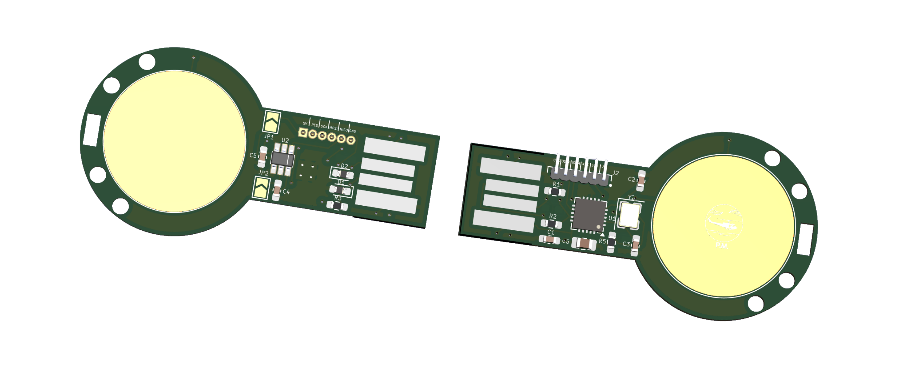


<p align="center">
  <b>3D model of the hardware login key’s PCB using the QFN package in KiCad.</b> 
  <br> 
  With the TTP223 IC. (Uses simple high/low output for touch detection, similar to a tactile switch, with default code for straightforward 0 or 1 output.)
</p>


## 🏗️ 3D Printed Enclosure

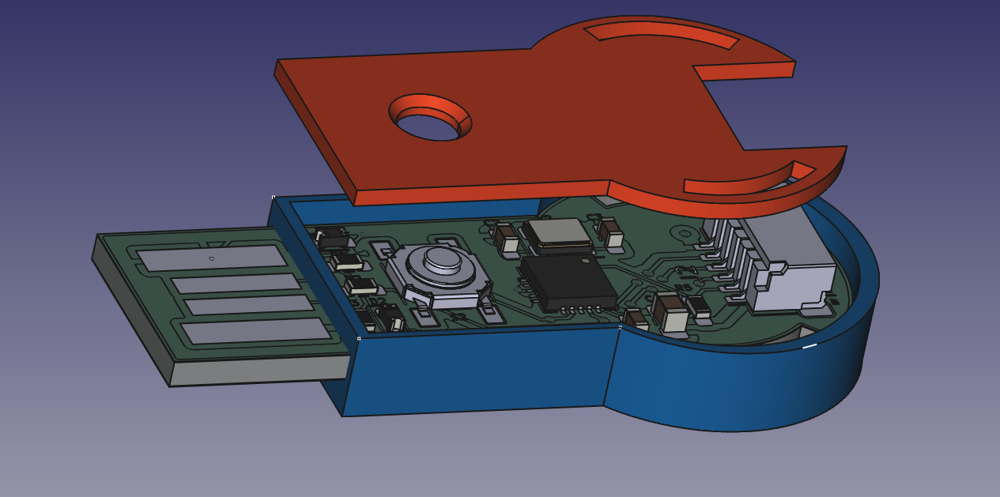

A 3D printed case is available for the hardware key. To use it, follow these steps:
1. Open the `3d_printed_case` folder.
2. Load the `hardware_key_case.stl` file into your 3D printer software.
3. Print the case using your 3D printer.
4. Once printed, assemble the hardware key inside the case for added protection and aesthetics.

## 📄 System Requirements Specification

[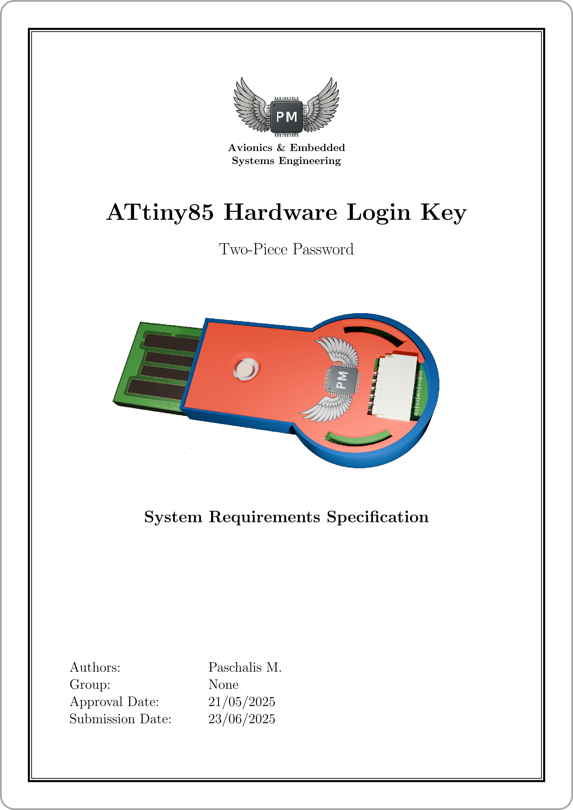](docs/SRS.pdf)
<p align="center">
  <b>Click the image to open the full SRS (PDF).</b>
</p>

## 🧑‍💻 Authors
- [](https://github.com/Paschalis) 

## 👥 Contributors
-
-
-
-

## 🙏 Acknowledgements

This project stands on the shoulders of giants. A special thank you to the developers and communities behind these essential open-source tools:

*   **V-USB:** The core USB functionality of this hardware key is made possible by the V-USB library, a firmware-only USB driver for AVR microcontrollers from [Objective Development](https://www.obdev.at/vusb/).
*   **KiCad:** All PCB designs were created using KiCad, a powerful, free, and open-source electronics design automation (EDA) suite. Learn more at the [KiCad website](https://www.kicad.org/).

## 📜 License

This project is licensed under the [GPLv3 License](https://opensource.org/licenses/GPL-3.0) - see the [LICENSE](LICENSE) file for details.

- <a href="LICENSE">
  
</a>

**Thank you for visiting Hardware-Login-Key!** 🔐✨