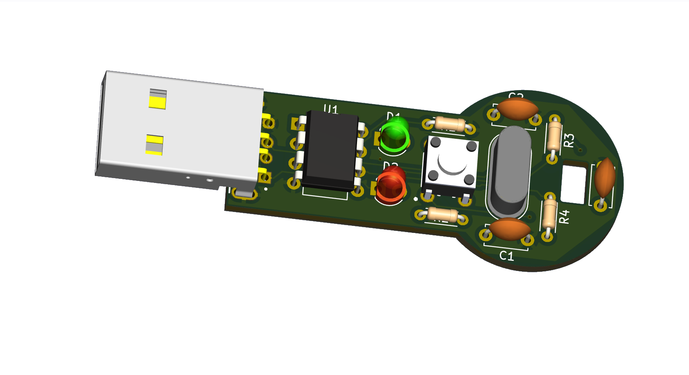
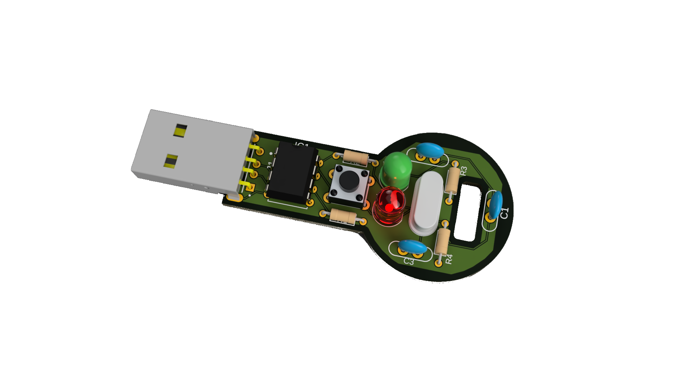
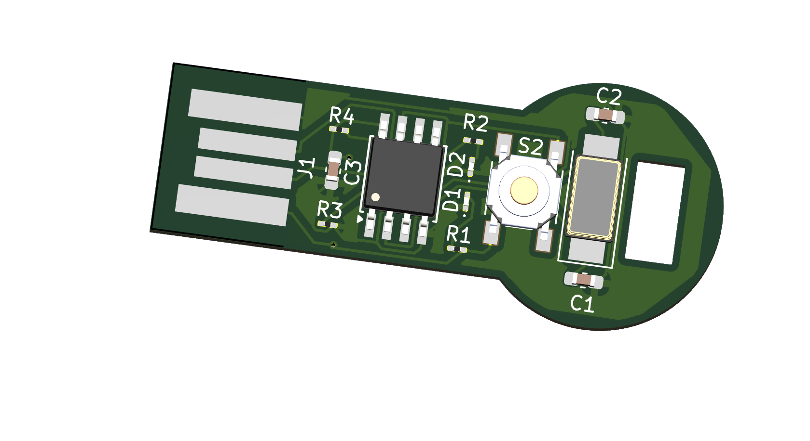
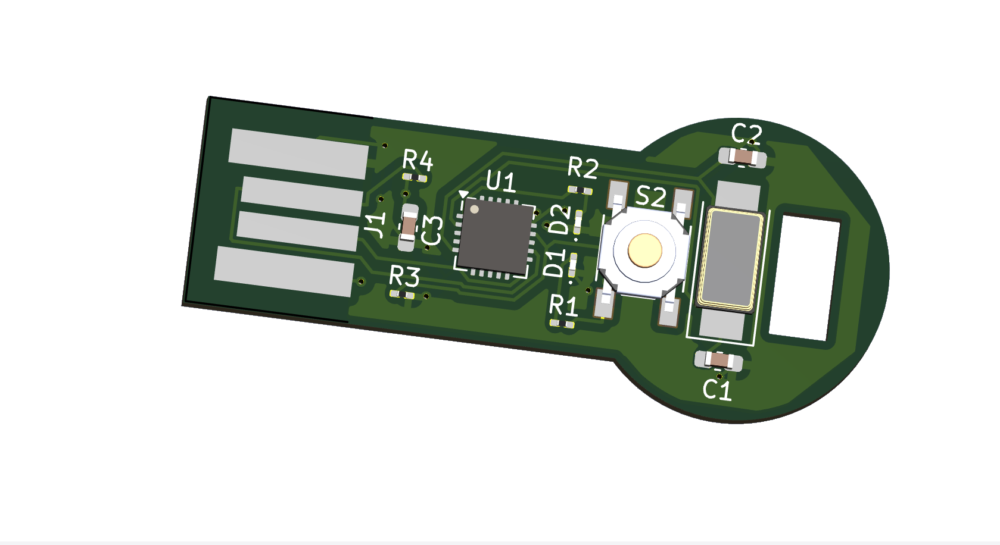

# 🔐 Hardware Login Key

## Introduction
This project offers a straightforward solution for securely logging into a system or website using a hardware key. By pressing a physical button connected to an ATtiny85 microcontroller, users can automate the login process, thereby reducing the risk of password exposure.

## 🎯 Purpose
The aim of this project is to provide a more secure alternative to manually typing long or complex passwords, particularly in environments where there may be observers or surveillance. With the hardware key, users can log in quickly and securely without the risk of their password being intercepted or observed.

## Benefits
- **Enhanced Security:** Prevents password interception by keystroke loggers or shoulder surfing.
- **Convenience:** Simplifies the login process, especially for systems with lengthy or complex passwords.
- **Privacy:** Maintains the confidentiality of passwords in public or shared environments.
- **Portability:** Easily carried and used on multiple systems or devices.

## How it Works
The hardware key utilizes an ATtiny85 microcontroller with the V-USB library to implement USB Human Interface Device (HID) keyboard functionality. This allows the ATtiny85 to act as a keyboard when connected to a computer via USB. When the button connected to the ATtiny85 is pressed, it sends predefined keystrokes to the computer, automating the login process.

## 📁 Folder Structure

  
<strong>C_implementation</strong>

  <ul>
    <li>single_file_project</li>
    <li>multi_file_project</li>
  </ul>

  
<strong>CPP_implementation</strong>

  <ul>
    <li>single_file_project</li>
    <li>multi_file_project</li>
  </ul>

  
<strong>3d_printed_case</strong>

  <ul>
    <li>hardware_key_case.stl</li>
  </ul>

  
<strong>PCB_Designs</strong>

  <ul>
    <li>Through-Hole_DIP</li>
    <li><strong>SMD</li>
  <ul>
    <li>SMD_SOIC</li>
    <li>SMD_QFN</li>

## Compilation Instructions

You can modify the permissions of `/dev/ttyACM0` to facilitate communication with your serial device. For detailed instructions, [click here](modify_permissions.md). 

### C Implementation
To compile the C implementation, follow these steps:

1. Open a terminal.
2. Navigate to the `C_implementation` folder.
3. Read the [instructions](INSTRUCTIONS_C.md) or refer to [using make](C_Makefile_Instructions.md) for the C implementation.

### C++ Implementation
To compile the C++ implementation, follow these steps:

1. Open a terminal.
2. Navigate to the `CPP_implementation` folder.
3. Read the [instructions](INSTRUCTIONS_CPP.md) for the C++ implementation.

## 📋 Usage
1. Connect the hardware key to the computer.
2. Press the button on the hardware key.
3. The hardware key sends the predefined keystrokes for logging in.
4. The user is logged in securely without typing the password manually.

## PCB Designs

### In KiCad

The hardware key is available in multiple PCB package versions to accommodate different assembly preferences:
- **Through-Hole (DIP)**: Easy to assemble manually, suitable for prototyping.
  - 
- **SMD (SOIC)**: For more compact and automated assembly.
  - 
- **SMD (QFN)**: For advanced designs requiring a small footprint.
  - 

### In Fusion 360

You can view the design files and images for each PCB version in the `PCB_Designs` folder.

## 🛒 Requirements

### DIP Version
| Reference | Value   | Datasheet | Footprint                                                        | Qty | DNP |
|-----------|---------|-----------|------------------------------------------------------------------|-----|-----|
| C1, C2    | 22pF    | ~         | Capacitor_THT:C_Disc_D5.0mm_W2.5mm_P5.00mm                       | 2   |     |
| C3    |  0.1uF   | ~         | Capacitor_THT:C_Disc_D5.0mm_W2.5mm_P5.00mm                       | 1   |     
| D1        | LED GREEN | ~        | LED_THT:LED_D3.0mm                                                | 1   |     |
| D2        | LED RED | ~         | LED_THT:LED_D3.0mm                                                | 1   |     |
| J1        | USB-AM-S-X-X-TH |   | USB-AM-S-X-X-TH:SAMTEC_USB-AM-S-X-X-TH                           | 1   |     |
| R1, R3    | 10k    | ~         | Resistor_THT:R_Axial_DIN0204_L3.6mm_D1.6mm_P5.08mm_Horizontal    | 2   |     |
| R2        | 330    | ~         | Resistor_THT:R_Axial_DIN0204_L3.6mm_D1.6mm_P5.08mm_Horizontal    | 1   |     |
| R4        | 1k5    | ~         | Resistor_THT:R_Axial_DIN0204_L3.6mm_D1.6mm_P5.08mm_Horizontal    | 1   |     |
| S1        | B3F-1000 | ~        | B3F-1000:SW_B3F-1000                                              | 1   |     |
| U1        | ATtiny85-20P | [Datasheet](http://ww1.microchip.com/downloads/en/DeviceDoc/atmel-2586-avr-8-bit-microcontroller-attiny25-attiny45-attiny85_datasheet.pdf) | Package_DIP:DIP-8_W7.62mm | 1   |     |
| Y1        | 12MHz   | ~         | Crystal:Crystal_HC49-4H_Vertical                                 | 1   |     |

  <b>3D model of the hardware login key’s PCB using the Through-Hole (DIP) package in KiCad</b>

  <b>3D model of the hardware login key’s PCB using the Through-Hole (DIP) package in Fusion 360</b>

### SMD Version (SOIC)
| Reference | Value   | Datasheet | Footprint                                                         | Qty | DNP |
|-----------|---------|-----------|-------------------------------------------------------------------|-----|-----|
| C1, C2    | 22pF    | ~         | Capacitor_SMD:C_0603_1608Metric_Pad1.08x0.95mm_HandSolder        | 2   |     |
| D1        | LED RED | ~         | LED_SMD:LED_0201_0603Metric_Pad0.64x0.40mm_HandSolder            | 1   |     |
| D2        | LED GREEN | ~        | LED_SMD:LED_0201_0603Metric_Pad0.64x0.40mm_HandSolder            | 1   |     |
| J1        | USB-AM-S-X-X-TH |   | USB-AM-S-X-X-TH:USB_PCB                                           | 1   |     |
| R1, R3    | 10k    | ~         | Resistor_SMD:R_0201_0603Metric_Pad0.64x0.40mm_HandSolder         | 2   |     |
| R2        | 330    | ~         | Resistor_SMD:R_0201_0603Metric_Pad0.64x0.40mm_HandSolder         | 1   |     |
| R4        | 1k5    | ~         | Resistor_SMD:R_0201_0603Metric_Pad0.64x0.40mm_HandSolder         | 1   |     |
| S2        | PTS525SM15SMTR2LFS | | PTS525SM15SMTR2LFS:SW_PTS525SM15SMTR2LFS                           | 1   |     |
| U1        | ATtiny85-20S | [Datasheet](http://ww1.microchip.com/downloads/en/DeviceDoc/atmel-2586-avr-8-bit-microcontroller-attiny25-attiny45-attiny85_datasheet.pdf) |  Package_SO:SOIC-8W_5.3x5.3mm_P1.27mm | 1   |     |
| Y1        | 12MHz   | ~         | Crystal:Crystal_SMD_0603-2Pin_6.0x3.5mm_HandSoldering            | 1   |     |

  <b>3D model of the hardware login key’s PCB using the SMD (SOIC) package in KiCad.</b>

### SMD Version (QFN)
| Reference | Value   | Datasheet | Footprint                                                         | Qty | DNP |
|-----------|---------|-----------|-------------------------------------------------------------------|-----|-----|
| C1, C2    | 22pF    | ~         | Capacitor_SMD:C_0603_1608Metric_Pad1.08x0.95mm_HandSolder        | 2   |     |
| D1        | LED RED | ~         | LED_SMD:LED_0201_0603Metric_Pad0.64x0.40mm_HandSolder            | 1   |     |
| D2        | LED GREEN | ~        | LED_SMD:LED_0201_0603Metric_Pad0.64x0.40mm_HandSolder            | 1   |     |
| J1        | USB-AM-S-X-X-TH |   | USB-AM-S-X-X-TH:USB_PCB                                           | 1   |     |
| R1, R3    | 10k    | ~         | Resistor_SMD:R_0201_0603Metric_Pad0.64x0.40mm_HandSolder         | 2   |     |
| R2        | 330    | ~         | Resistor_SMD:R_0201_0603Metric_Pad0.64x0.40mm_HandSolder         | 1   |     |
| R4        | 1k5    | ~         | Resistor_SMD:R_0201_0603Metric_Pad0.64x0.40mm_HandSolder         | 1   |     |
| S2        | PTS525SM15SMTR2LFS | | PTS525SM15SMTR2LFS:SW_PTS525SM15SMTR2LFS                           | 1   |     |
| U1        | ATtiny85-20M | [Datasheet](http://ww1.microchip.com/downloads/en/DeviceDoc/atmel-2586-avr-8-bit-microcontroller-attiny25-attiny45-attiny85_datasheet.pdf) | Package_DFN_QFN:QFN-20-1EP_4x4mm_P0.5mm_EP2.5x2.5mm_ThermalVias | 1   |     |
| Y1        | 12MHz   | ~         | Crystal:Crystal_SMD_0603-2Pin_6.0x3.5mm_HandSoldering            | 1   |     |

  <b>3D model of the hardware login key’s PCB using the QFN package in KiCad.</b>

## Security Considerations
- Ensure the physical security of the hardware key to prevent unauthorized access.
- Keep the key firmware up-to-date to mitigate potential security vulnerabilities.
- Do not use the hardware key on untrusted or compromised systems.
- Use strong encryption and authentication methods in addition to the hardware key for robust security.

## 🏗️ 3D Printed Case
A 3D printed case is available for the hardware key. To use it, follow these steps:

1. Open the `3d_printed_case` folder.
2. Load the `hardware_key_case.stl` file into your 3D printer software.
3. Print the case using your 3D printer.
4. Once printed, assemble the hardware key inside the case for added protection and aesthetics.

## 📜 License

This project is licensed under the [MIT License](LICENSE).

- 

## 🧑‍💻 Authors
-  

## 👥 Contributors
-
-
-
-

**Enjoy** your secure **hardware** login key 🔐! **Thank you for visiting Hardware-Login-Key!** ✨
